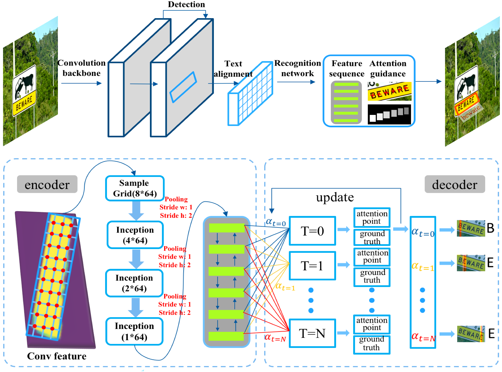

# An End-to-End TextSpotter with Explicit Alignment and Attention

This is initially described in our [CVPR 2018 paper](https://arxiv.org/abs/1803.03474).




## Getting Started
### Installation
- Clone the code
```bash
git clone https://github.com/tonghe90/textspotter
cd textspotter
```

- Install caffe. You can follow this [this tutorial](http://caffe.berkeleyvision.org/installation.html)
```bash
# make sure you set WITH_PYTHON_LAYER := 1
# change Makefile.config according to your library path
cp Makefile.config.example Makefile.config
make -j8
make pycaffe
```

- install editdistance and pyclipper: `pip install editdistance` and  `pip install pyclipper`

- After Caffe is set up, you need to download a trained model (about 40M) from [Google Drive](https://drive.google.com/open?id=1lzM-V1Ec8KHr8fKxeO_d1x3zFaj3bmnU). This model
  is trained with [VGG800k](http://www.robots.ox.ac.uk/~vgg/data/scenetext/) and finetuned on [ICDAR2015](http://rrc.cvc.uab.es/?ch=4&com=introduction).
- Run `python test.py --img=./imgs/img_105.jpg`

- hyperparameters:

```bash
cfg.py --mean_val ==> mean value during the testing.
       --max_len ==> maximum length of the text string (here we take 25, meaning a word can contain 25 characters at most.)
       --recog_th ==> the threshold during the recognition process. The score for a word is the average mean of every character.
       --word_score ==> the threshold for those words that contain number or symbols for they are not contained in the dictionary.

test.py --weight ==> weights file of caffemodel
        --prototxt-iou ==> the prototxt file for detection.
        --prototxt-lstm ==> the prototxt file for recognition.
        --img ==> the folder or img file for testing. The format can be added in ./pylayer/tool is_image function.
        --scales-ms ==> multiscales input for input during the testing process.
        --thresholds-ms ==> corresponding thresholds of text region for multiscale inputs.
        --nms ==> nms threshold for testing
        --save-dir ==> the dir for save results in format of ICDAR2015 submition.
```

## Citation
If you use this code for your research, please cite our papers.
```
@inproceedings{tong2018,
  title={An End-to-End TextSpotter with Explicit Alignment and Attention},
  author={T. He and Z. Tian and W. Huang and C. Shen and Y. Qiao and C. Sun},
  booktitle={Computer Vision and Pattern Recognition (CVPR), 2018 IEEE Conference on},
  year={2018}
}

```
## License

This code is for NON-COMMERCIAL purposes only. For commerical purposes, please contact Chunhua Shen <chhshen@gmail.com>.
This program is free software: you can redistribute it and/or modify it under the terms of the GNU General Public License as published by the Free Software Foundation, version 3. Please refer to <http://www.gnu.org/licenses/> for more details.